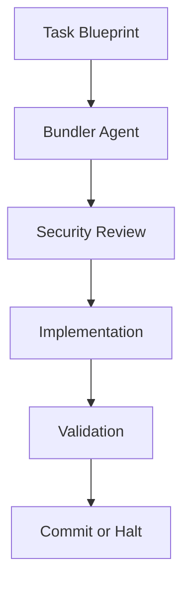

# Design Patterns and Guidelines

## SDD Methodology Core Patterns

### 1. Assembly Line Model
The fundamental pattern for task execution:

```
Bundler Agent → Security Consultant → Coder Agent → Validator Agent
     ↓               ↓                   ↓            ↓
  Research      Security Review    Implementation  Validation
```

**Key Principle**: Only validated work proceeds to the next stage

### 2. Specification Hierarchy Pattern
Top-down document flow ensuring consistency:

```
Project Vision (Strategic "Why")
    ↓
Product Requirements (Functional "What") 
    ↓
Architecture (Technical "How")
    ↓
Roadmap (Temporal "When")
    ↓
Milestone Plans (Tactical execution)
    ↓  
Task Blueprints (Atomic work units)
```

**Key Principle**: Changes flow downward, maintaining alignment

### 3. Quality Gates Pattern
Each stage has specific validation criteria:

- **Vision**: Strategic alignment, stakeholder buy-in
- **Requirements**: Completeness, testability, feasibility
- **Architecture**: Technical feasibility, scalability, security
- **Tasks**: Atomicity, testability, clear acceptance criteria

## Claude Code Integration Patterns

### 1. Native Feature Leveraging
Utilize Claude Code's built-in capabilities:

- **Slash Commands**: Workflow orchestration (`/init_greenfield`, `/plan_milestone`)
- **Sub-agents**: Specialized contexts with clean separation
- **File-based State**: No external dependencies, pure file operations
- **Hooks**: Observability and logging (not workflow control)

### 2. Template Distribution Pattern
Global template system:

```
~/.sdd/templates/     # Global templates (installed once)
    ↓
Project specs/        # Local project specifications  
    ↓
.task_bundles/       # Agent workspaces (ephemeral)
```

### 3. Agent Specialization Pattern
Each agent has a specific, focused role:

- **Bundler Agent**: Context research, prevents hallucination
- **Security Consultant**: Proactive security guidance  
- **Coder Agent**: TDD-based implementation
- **Validator Agent**: Comprehensive quality checks

## Documentation Design Patterns

### 1. Concrete Over Abstract
Always prefer specific examples:

```markdown
# Bad (Abstract)
The system should handle user authentication.

# Good (Concrete)  
The system must authenticate users via OAuth 2.0 with Google/GitHub providers,
maintaining sessions for 24 hours, with automatic refresh tokens.
```

### 2. Mermaid Diagrams for Workflows
Use visual representations for complex processes:



### 3. Version-Aware Templates
All templates include versioning for evolution:

```yaml
---
version: "1.0.0"
description: "Template description"
created: "2024-01-01"
updated: "2024-01-01"
---
```

## Security Design Patterns

### 1. Path Traversal Protection
All file operations validate paths:

```bash
validate_path() {
    local path="$1"
    local allowed_prefix="$2"
    # Implement realpath validation
}
```

### 2. Secure Defaults
- File permissions: 644 for docs, 755 for scripts
- No sudo requirements in installation
- Principle of least privilege

### 3. Proactive Security Review
Security consultant agent reviews every task before implementation

## Error Handling Patterns

### 1. Graceful Degradation
Installation continues even if optional components fail:

```bash
# Agents are optional - don't fail if directory doesn't exist
if [ ! -d "$AGENTS_SOURCE" ]; then
    log_info "No agents directory found - skipping agent installation"
    return 0
fi
```

### 2. Comprehensive Error Reporting
Provide actionable recovery steps:

```bash
handle_error() {
    local exit_code=$?
    log_error "Installation failed at line $line_number (exit code: $exit_code)"
    echo "Recovery suggestions:"
    echo "  1. Check file permissions in target directories"
    echo "  2. Ensure sufficient disk space is available"
}
```

### 3. Version Conflict Resolution
Handle version mismatches gracefully:
- Skip downgrades with warning
- Log version changes
- Provide clear upgrade paths

## Anti-Patterns to Avoid

### 1. External Dependencies
- No databases, APIs, or external services
- Pure file-based operations only
- Claude Code native features preferred

### 2. Workflow Control via Hooks
- Hooks are for observability only
- Never use hooks to control workflow execution
- Keep workflow logic in agents and commands

### 3. Abstract Specifications
- Avoid vague requirements or architectures
- Always provide concrete, testable criteria
- Include specific examples and constraints

### 4. Breaking Specification Hierarchy
- Don't change lower-level docs without upper-level alignment
- Maintain top-down consistency
- Use Architecture Decision Records (ADRs) for architecture changes