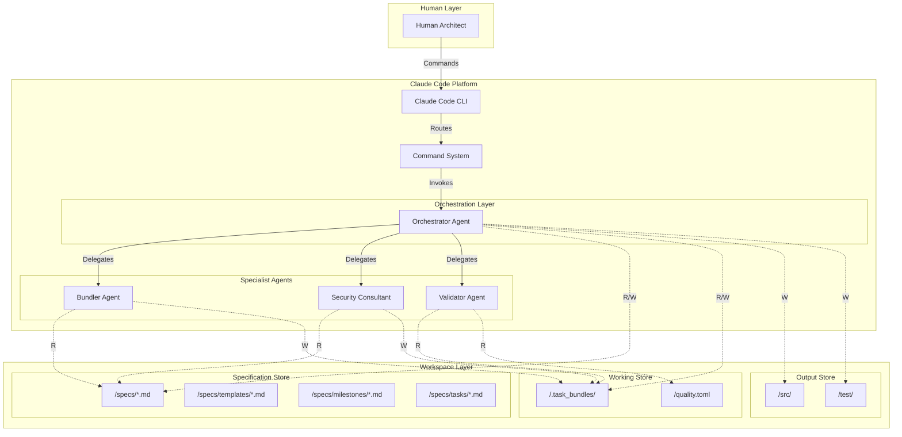
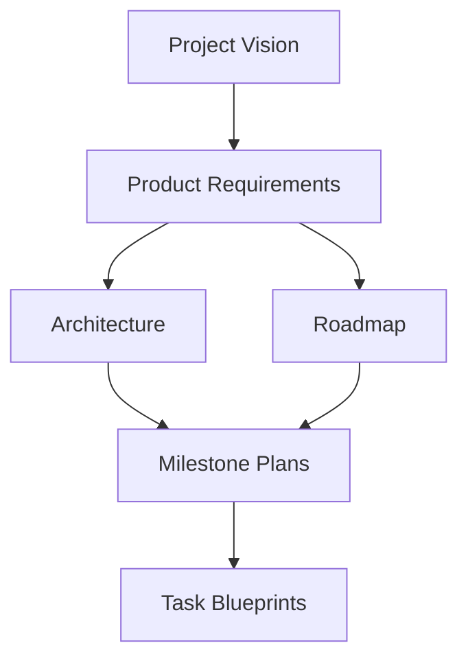
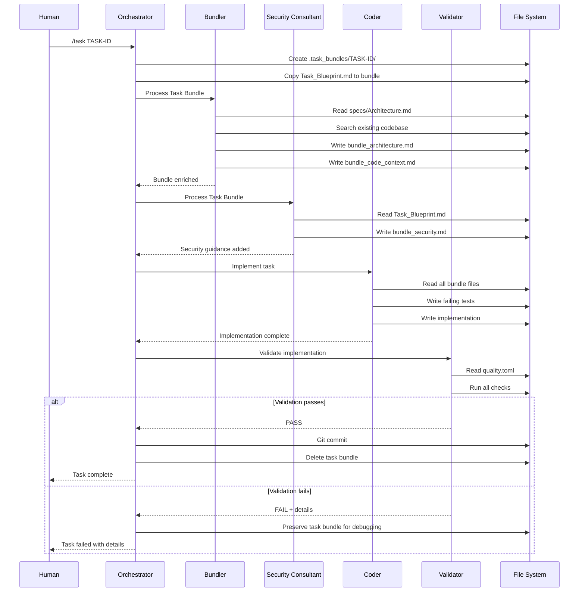

# Architectural Specification: SDD System for Claude Code

**Purpose of this document:** This document outlines the technical architecture for the Spec-Driven Development (SDD) System as implemented on the Claude Code platform. It serves as the engineering team's blueprint, defining the high-level structure, technology stack, design patterns, and infrastructure. Its goal is to ensure the system is built in a way that is scalable, maintainable, and aligned with the product requirements.

**Link to Requirements:** `[Link to 1_Product_Requirements.md]`

---

## 1. Architectural Goals and Constraints

**What it is:** This section describes the primary drivers and limitations that shape the architecture. It directly translates the Non-Functional Requirements (NFRs) from the PRD into architectural principles.

| Goal / Constraint                    | Driving NFRs                               | Description                                                                                                           |
| ------------------------------------ | ------------------------------------------ | --------------------------------------------------------------------------------------------------------------------- |
| **Goal: Platform-Native Integration**| `NFR-INT-001 (Claude Code Integration)`    | Architecture must leverage Claude Code's native features (commands, sub-agents, hooks) without external dependencies.  |
| **Goal: Deterministic Execution**    | `NFR-REL-001 (Reliability)`                | Each workflow must produce consistent, predictable results given the same inputs and specifications.                   |
| **Goal: Contextual Isolation**       | `NFR-PERF-001 (Context Management)`        | Sub-agents must operate with clean, focused contexts to prevent degradation and hallucination.                        |
| **Goal: Stateless Workflows**        | `NFR-SCALE-001 (Scalability)`              | All workflows must be stateless, deriving state from the file system to enable parallel execution.                    |
| **Constraint: File-Based State**     | `Claude Code Platform`                      | All system state must be persisted as files in the workspace; no external databases or services.                      |
| **Constraint: Single Language**      | `Team Skills, Platform Support`             | System configuration and orchestration logic must be expressed through Claude Code's native formats (Markdown with frontmatter, JSON for hooks).         |
| **Constraint: No External APIs**     | `Security, Platform Limitations`            | The system cannot make external HTTP calls; all operations must be self-contained within the workspace.               |

---

## 2. System Architecture Overview

**What it is:** A high-level, visual representation of the system's structure using the C4 model's Container diagram level.



**Description:** The system consists of three primary layers:

1. **Human Layer:** The Human Architect interacts with the system through Claude Code CLI commands.
2. **Claude Code Platform:** Contains the command routing system and the agent orchestration layer, with specialized sub-agents for different concerns.
3. **Workspace Layer:** The file system serves as the persistent state store, divided into specifications, working directories, and output artifacts.

---

## 3. Technology Stack

**What it is:** A definitive list of the approved technologies, frameworks, and major libraries for the project.

| Category               | Technology              | Justification                                                          |
| ---------------------- | ----------------------- | ---------------------------------------------------------------------- |
| **Platform**           | Claude Code             | Target deployment platform with native agent support.                   |
| **Commands**           | [Slash Commands](https://docs.anthropic.com/en/docs/claude-code/slash-commands) | **Primary workflow triggers** - Native command system stored as Markdown files (`.claude/commands/*.md`) that orchestrate all SDD workflows (`/init_greenfield`, `/task`, `/milestone`, etc.) |
| **Agent Orchestration**| [Sub-agents](https://docs.anthropic.com/en/docs/claude-code/sub-agents) | Native sub-agent system defined as Markdown files with YAML frontmatter (`.claude/agents/*.md`) for specialized tasks |
| **Event System**       | [Hooks](https://docs.anthropic.com/en/docs/claude-code/hooks) | Native hook system configured via JSON in settings files (`.claude/settings.json`) for observability and logging |
| **Specification**      | Markdown                | Human-readable, version-controllable format for all specification documents      |
| **Quality Config**     | TOML                    | Configuration format for quality checks and validation rules (`quality.toml`)           |
| **Diagramming**        | Mermaid                 | Embedded diagrams in Markdown for architecture visualization           |

**System-Specific Configuration Details:**

- **Slash Commands**: **THE PRIMARY INTERFACE** for all SDD workflows. Defined as Markdown files with optional YAML frontmatter for metadata (tools, description, model). Each command orchestrates specific workflows by invoking sub-agents in predetermined sequences.
- **Sub-agents**: Markdown files with YAML frontmatter containing name, description, and tool restrictions. Invoked by slash commands to perform specialized tasks.
- **Hooks**: JSON configuration in settings files supporting multiple event types for passive observability and logging (NOT workflow control).
- **File-Based Architecture**: All system configuration and state uses standard file formats stored in the workspace

---

## 4. Development Tooling and Quality Standards

**What it is:** This section defines the development workflow, tooling choices, and quality standards for the SDD project. It provides guidance to agents and developers on how to build, test, and validate the SDD system consistently.

### 4.1 Language and Runtime Environment

* **Primary Language**: Markdown with YAML frontmatter (specification documents)
* **Scripting**: Bash scripts for testing and utility functions  
* **Configuration**: JSON for Claude Code settings and hooks
* **Documentation**: Markdown with Mermaid diagrams for architecture visualization
* **Package Management**: None required (specification-only repository with no build dependencies)

### 4.2 Quality Tooling by Component

#### Testing Infrastructure
* **Testing Framework**: Bash-based testing with custom assertion functions
* **Test Execution**: Direct bash script execution via `bash test-script.sh`  
* **Test Organization**: Organized in `/tests/` directory with descriptive naming (`test-*.sh`)
* **Assertion Functions**: Custom `assert_success()`, `assert_file_exists()`, `assert_contains()` functions
* **Test Reporting**: Structured output with colored logging and detailed results

#### Python Components (When Present)
* **Testing**: pytest with configuration in `pytest.ini`, appropriate test discovery and options
* **Type Checking**: mypy with configuration in `mypy.ini` for strict type checking
* **Package Management**: Standard pip/python approach (no special package manager specified)
* **Code Quality**: Follow standard Python conventions for any utility scripts

#### Documentation and Configuration
* **Markdown Linting**: Follow CommonMark specification for consistency
* **YAML Validation**: Ensure valid YAML structure in frontmatter and configuration files
* **JSON Validation**: Validate JSON configuration files for hooks and settings
* **Link Validation**: Verify internal links between specification documents

### 4.3 Validation Workflow and Standards

The validation workflow ensures specification and code quality through these steps:

1. **Specification Testing**: Bash-based tests validate that specifications produce expected system behavior
2. **Documentation Consistency**: Cross-reference validation between specification documents  
3. **Template Compliance**: Verify that generated documents follow established templates
4. **Integration Testing**: End-to-end workflow validation using sample task blueprints
5. **Quality Verification**: Ensure all specifications are actionable and complete

**Validation Standards:**
* **Required**: All bash tests must pass, specification documents must be internally consistent
* **Required**: Template compliance for all generated specification documents
* **Recommended**: Documentation completeness, clear examples in all templates
* **Context-Sensitive**: Testing approaches should adapt based on what components are being validated (pure specification vs. code generation)

**Validation Command Examples:**
- Bash testing: `bash tests/test-end-to-end.sh` (execute specific test scripts)
- Python components: `python3 -m pytest tests/ -v` (when Python testing is needed)
- Integration testing: `bash tests/test-task-workflow-e2e.sh` (full workflow validation)

### 4.4 SDD System Specific Considerations

**Specification Validation**: Primary focus is on validating that specifications correctly drive the SDD workflow, not traditional code validation.

**Agent Testing**: Testing validates agent behavior through bundle creation and task execution simulation rather than unit testing of agent code.

**Workflow Testing**: End-to-end testing focuses on the complete specification-to-implementation pipeline working correctly.

**Quality Focus**: Emphasis on specification completeness, template consistency, and workflow reliability rather than traditional code metrics.

---

## 5. Sub-Agent Architecture

**What it is:** The specialized agent system that enables context isolation and prevents context pollution through focused, single-purpose agents with clean contexts.

### 4.1 Sub-Agent Design Principles

**Core Architecture Goals:**

- **Context Isolation**: Each sub-agent receives only the context needed for its specific task, preventing context pollution
- **Specialized Expertise**: Sub-agents are designed with deep, focused knowledge in their domain
- **Clean Handoffs**: Sub-agents generate structured outputs that main agents can directly use
- **Quality Consistency**: Sub-agents maintain consistent quality standards across all generated content

### 4.2 Hybrid Main Agent + Sub-Agent Approach

**Validated Architecture Pattern:**

| Document Type | Handler | Rationale | Context Provided | Output Format |
| ------------- | ------- | --------- | ---------------- | ------------- |
| **Project Vision** | **Main Agent** | Conversational, no research needed, provides context for sub-agents | User conversation + SDD methodology | Complete Vision.md through guided conversation |
| **Product Requirements** | **Requirements Sub-Agent** | Research-heavy, needs clean context, builds on vision | Vision.md + SDD methodology + templates + web research | Complete Requirements.md + numbered strategic questions |
| **Architecture** | **Architecture Sub-Agent** | Research-heavy, needs clean context, builds on requirements | Vision.md + Requirements.md + SDD methodology + templates + web research | Complete Architecture.md + numbered strategic questions |
| **Roadmap** | **Roadmap Sub-Agent** | Research-heavy, needs clean context, builds on all specs | All prior specs + SDD methodology + templates + web research | Complete Roadmap.md + numbered strategic questions |

**Key Principles:**
- **Main Agent**: Handles conversational, context-building work (Vision)
- **Sub-Agents**: Handle research-intensive, specification generation work (Requirements, Architecture, Roadmap)
- **Clean Contexts**: Sub-agents start fresh with only relevant specifications and methodology
- **Research-Driven**: Sub-agents perform extensive web research for informed decisions
- **Question-Based**: Sub-agents generate numbered strategic questions only for specification gaps

### 4.3 Sub-Agent Context Management

**Context Isolation Strategy:**

1. **Clean Context Initialization**: Each sub-agent starts with a fresh context containing only:
   - Relevant SDD methodology documentation for their specialty
   - Specific templates for their document type
   - Previous specification documents needed for their work
   - No conversation history or unrelated context

2. **Structured Input Preparation**: Main agent prepares structured input containing:
   - User requirements and clarifications
   - Specific questions answered by user
   - Dependencies from other specification documents
   - Quality requirements and constraints

3. **Focused Output Generation**: Sub-agents produce:
   - Complete specification documents following templates
   - Strategic questions for user clarification
   - Self-review findings and improvement recommendations
   - Cross-references to other specification documents

### 4.3.1 Sub-Agent Iterative Quality Process

**What it is:** The proven iterative refinement workflow that ensures sub-agents are accountable for document quality and collaborate with Main Agents to resolve specification gaps.

**Core Process Pattern: `Main Agent ↔ Sub-Agent ↔ Main Agent ↔ User`**

#### Phase 1: Sub-Agent Document Creation

1. **Context Reception**: Sub-agent receives structured context from Main Agent including:
   - Previous specification documents
   - User conversation history and decisions
   - Specific template requirements
   - Quality standards and constraints

2. **Document Generation**: Sub-agent creates complete, template-compliant document
3. **Critical Self-Review**: Sub-agent performs comprehensive self-assessment:
   - **Gap Analysis**: Identifies missing information, unclear requirements, or assumptions
   - **Quality Validation**: Verifies template compliance, cross-references, and requirement traceability
   - **Assumption Detection**: Flags any assumptions made that require user validation
   - **Content Assessment**: Reviews for completeness, actionability, and strategic alignment

#### Phase 2: Strategic Question Generation

1. **Question Formulation**: Sub-agent generates **numbered strategic questions (1., 2., 3., etc.)** for:
   - Specification gaps that prevent complete document creation
   - Assumptions that need user validation or clarification
   - Strategic decisions requiring user input or preferences
   - Missing context that impacts document quality or accuracy

2. **Deliverable Package**: Sub-agent returns to Main Agent:
   - **Complete draft document** (even with identified gaps)
   - **Numbered strategic questions** for user clarification
   - **Self-review findings** highlighting quality concerns or assumptions
   - **Refinement recommendations** for improving document quality

#### Phase 3: Main Agent Facilitation

1. **Question Presentation**: Main Agent presents sub-agent's strategic questions to user in conversational format
2. **Context Gathering**: Main Agent collects detailed user responses, clarifications, and decisions
3. **Refinement Coordination**: Main Agent determines if additional sub-agent iteration is needed

#### Phase 4: Iterative Refinement

1. **Refinement Loop**: If gaps remain, Main Agent returns to sub-agent with:
   - User answers to strategic questions
   - Additional context and clarifications
   - Refinement requirements and quality expectations

2. **Quality Convergence**: Process continues until:
    - Sub-agent self-review identifies no critical gaps
    - User confirms document meets their requirements
    - Document passes all template compliance and quality checks

#### Critical Success Factors

**Sub-Agent Accountability:**

- Sub-agents are **responsible for document quality** and must identify their own limitations
- Sub-agents **must not make assumptions** - when uncertain, they generate strategic questions
- Sub-agents perform **mandatory self-review** and flag quality concerns proactively

**Main Agent Facilitation:**

- Main Agent **never bypasses** sub-agent accountability by making document decisions
- Main Agent **facilitates user interaction** to resolve sub-agent questions
- Main Agent **coordinates refinement** but does not override sub-agent expertise

**User Collaboration:**

- User provides **strategic direction** and decisions in response to sub-agent questions
- User **validates assumptions** and provides missing context for document completion
- User **approves final documents** before process proceeds to next phase

This iterative process ensures that sub-agents remain accountable for quality while leveraging user expertise for strategic decisions and gap resolution.

### 4.4 Slash Command Architecture

**What it is:** The primary user interface and workflow orchestration system that coordinates sub-agents for SDD operations.

#### 4.4.1 Command Hierarchy

**Core SDD Commands:**

| Command                  | Purpose                                          | Hybrid Orchestration Pattern             |
| ------------------------ | ------------------------------------------------ | ---------------------------------------- |
| `/init_greenfield`       | Initialize new SDD project from scratch         | Main Agent (Vision) → Requirements Sub-Agent → Architecture Sub-Agent → Roadmap Sub-Agent |
| `/init_brownfield`       | Adopt SDD for existing project                  | Main Agent (Vision) → Requirements Sub-Agent → Architecture Sub-Agent → Roadmap Sub-Agent |
| `/milestone MILESTONE-ID`| Execute a complete milestone                     | Task Specialist for each task in sequence |
| `/task TASK-ID`          | Execute a single development task               | Task Specialist with isolated context |
| `/spec_update TYPE`      | Update specification documents                   | Relevant Specialist with current context |

#### 4.4.2 Command-to-Sub-Agent Orchestration

**How Sub-Agent Commands Work:**

1. **User Invocation**: Human architect types slash command (e.g., `/init_greenfield project-name`)
2. **Command Processing**: Claude Code routes to appropriate command definition (`.claude/commands/init_greenfield.md`)
3. **Context Preparation**: Main agent gathers user requirements through guided conversation
4. **Sub-Agent Invocation**: Main agent invokes specialized sub-agents with clean, focused contexts:
   - **Vision Specialist**: Receives user vision + SDD vision methodology
   - **Requirements Specialist**: Receives approved vision + SDD requirements methodology  
   - **Architecture Specialist**: Receives vision + requirements + SDD architecture methodology
   - **Roadmap Specialist**: Receives all prior specs + SDD roadmap methodology
5. **Quality Integration**: Main agent integrates sub-agent outputs and facilitates user review
6. **Result Delivery**: Main agent coordinates final document approval and delivery

#### 4.4.3 Sub-Agent Command Definition Structure

**Standard SDD Command Frontmatter for Sub-Agent Commands:**

All SDD commands using sub-agents must follow this frontmatter pattern:

```markdown
---
description: "Clear, concise command purpose"
argument-hint: "[expected parameters]"
allowed-tools: ["Write", "Read", "LS", "Task"]  # Task tool required for sub-agents
---
```

**Sub-Agent Command Example:**

```markdown
---
description: "Initialize new SDD project through guided specification creation using specialized sub-agents"
argument-hint: "[project-name] (optional)"
allowed-tools: ["Write", "Read", "LS", "Task"]
---

# Greenfield Project Initialization with Sub-Agents

Act as a product and technical specification orchestrator. Guide the user through creating comprehensive project documentation by coordinating specialized sub-agents following the SDD methodology.

## Phase 1: User Requirements Gathering
[Collect user requirements through conversation]

## Phase 2: Sub-Agent Orchestration
For each specification document, invoke the appropriate specialist sub-agent:

### Vision Document Generation
Use Task tool to invoke "vision-specialist" sub-agent with:
- User requirements and vision
- SDD Vision methodology
- Vision document template

### Requirements Document Generation  
Use Task tool to invoke "requirements-specialist" sub-agent with:
- Approved vision document
- User clarifications
- SDD Requirements methodology
- Requirements document template

[Continue pattern for Architecture and Roadmap specialists]
```

**Key Sub-Agent Principles:**

- **Context Isolation**: Commands use Task tool to invoke sub-agents with clean contexts
- **Specialized Expertise**: Each sub-agent has deep domain knowledge without context pollution
- **Structured Handoffs**: Sub-agents receive structured input and produce complete outputs
- **Quality Orchestration**: Main agent coordinates review and refinement with user

---

## 6. Key Design Patterns & Conventions

**What it is:** Mandatory patterns and conventions to ensure the codebase is consistent, predictable, and maintainable.

### Agent Design Patterns

- **Single Responsibility Principle:** Each agent must have exactly one well-defined purpose. Complex workflows are achieved through orchestration, not monolithic agents.
- **Context Isolation:** Agents receive their primary working context through the Task Bundle directory, but may access filesystem resources as needed for their specific responsibilities (e.g., Bundler reads specifications and codebase, Coder reads/writes source files).
- **Fail-Fast Validation:** Agents must validate their inputs immediately and fail with descriptive errors rather than attempting partial completion.
- **Deterministic Interfaces:** While LLM outputs may vary, agents must provide consistent input/output interfaces and error handling patterns.

### Workflow Patterns

- **Assembly Line Pattern:** Tasks flow through a predetermined sequence of specialized agents, with support for iteration and refinement cycles when quality standards are not initially met.
- **Bundle Enrichment:** Each agent in the workflow adds context and artifacts to the Task Bundle, creating a comprehensive workspace for downstream agents.
- **Quality-Gated Commits:** The Orchestrator only commits work that passes all validation checks, though this may result in larger, more comprehensive commits.

### Configuration Patterns

- **Convention over Configuration:** Standard file locations and naming conventions reduce the need for explicit configuration.
- **Declarative Commands:** All custom commands are defined declaratively in Markdown without imperative logic.
- **Template-Driven Generation:** All specification documents must be created from templates to ensure consistency.

---

## 7. Data Management

**What it is:** How data is stored, managed, and accessed within the system.

### Specification Hierarchy



### File System Structure

- **Living Specifications:** Specification documents evolve throughout the project lifecycle as described in the Specification Hierarchy, with controlled versioning and change management.
- **Temporal Isolation:** Task Bundles exist in timestamped directories to prevent conflicts during parallel execution.
- **Hierarchical Organization:** Files are organized by type and scope (project → milestone → task).

### State Management

- **Stateless Agents:** Agents derive all necessary state from their input bundle and produce output as new files.
- **Simple Coordination:** Inter-agent coordination relies on file system conventions and sequential execution rather than complex locking mechanisms.
- **Audit Trail:** All modifications are tracked through Git commits with standardized messages.

---

## 8. Component Specifications

**What it is:** Detailed specifications for each system component, defining their responsibilities, inputs, outputs, and interfaces.

### 7.1 Orchestrator Agent (Supervisor Agent)

**Responsibility:** Manages the overall task lifecycle and coordinates specialist agents.

**Inputs:**

- Task Blueprint (`Task_Blueprint.md`)
- Target Task Bundle directory path

**Outputs:**

- Completed implementation in `/src/` and `/test/`
- Git commit with standardized message
- Task status (pass/fail)

**Key Operations:**

1. Creates temporary Task Bundle directory (`.task_bundles/TASK-ID/`)
2. Copies Task Blueprint into bundle
3. Sequentially invokes specialist agents
4. Commits successful work or halts on failure

### 7.2 Bundler Agent

**Responsibility:** Research and context preparation to prevent hallucination and context loss.

**Model:** `claude-sonnet-4-20250514` (optimized for cost-efficient information processing and research)

**Inputs:**

- Task Bundle directory path
- Access to `/specs/Architecture.md`
- Access to existing codebase

**Outputs:**

- `bundle_architecture.md` - Relevant architectural rules for the task
- `bundle_code_context.md` - Exact signatures and documentation of relevant existing code
- Additional context files as needed

**Key Operations:**

1. **Architectural Analysis:** Extract specific rules from Architecture.md relevant to the task
2. **Codebase Intelligence:** Perform semantic search to find relevant internal code
3. **Interface Extraction:** Extract exact function signatures, arguments, and documentation
4. **External Knowledge Integration:** Fetch relevant API documentation for third-party libraries
5. **Context Assembly:** Create structured context files in the Task Bundle

### 7.3 Security Consultant Agent

**Responsibility:** Provide proactive security guidance for the specific task.

**Model:** `claude-sonnet-4-20250514` (optimized for systematic security analysis and research)

**Inputs:**

- Task Bundle directory path
- Task Blueprint content

**Outputs:**

- `bundle_security.md` - Specific, actionable security advice for the task

**Key Operations:**

1. Analyze task requirements for security implications
2. Generate task-specific security guidance
3. Add security considerations to Task Bundle

### 7.4 Coder Agent

**Responsibility:** Implementation and testing following TDD principles.

**Model:** `claude-opus-4-1-20250805` (optimized for creative problem-solving and high-quality code generation with rich context)

**Inputs:**

- Task Bundle directory with all context files
- Task Blueprint with requirements

**Outputs:**

- Implementation code
- Unit tests (written first, following TDD)
- Implementation plan documentation

**Key Operations:**

1. Read Task Blueprint and all `bundle_*.md` files
2. Devise step-by-step implementation plan
3. Write failing unit tests that reflect task contract
4. Implement code to make tests pass
5. Adhere to all architectural and security guidance

### 7.5 Validator Agent

**Responsibility:** Comprehensive quality assurance and verification.

**Model:** `claude-sonnet-4-20250514` (optimized for systematic testing, validation, and quality assurance)

**Inputs:**

- Task Bundle directory
- `/quality.toml` configuration
- Task Blueprint verification context
- Milestone Plan integration tests (if applicable)

**Outputs:**

- Single pass/fail verdict
- Detailed failure report (if applicable)

**Key Operations:**

1. **Test Plan Assembly:** Combine verification context, integration tests, and quality checks
2. **Execution:** Run linting, security scanning, unit tests, and integration tests
3. **Reporting:** Provide precise failure details or success confirmation

## 9. Workflow Specifications

**What it is:** The detailed step-by-step process for task execution.

### 8.1 Core Task Lifecycle



### 8.2 Task Bundle Structure

**Standard Task Bundle Contents:**

```text
.task_bundles/TASK-ID/
├── Task_Blueprint.md           # Original task specification
├── bundle_architecture.md      # Relevant architectural rules
├── bundle_code_context.md      # Existing code interfaces
├── bundle_security.md          # Security guidance
└── [additional context files]  # As needed by Bundler
```

### 8.3 Agent Communication Protocol

**All agent communication follows this pattern:**

1. **Input:** Task Bundle directory path passed as argument
2. **Context:** Agent reads required files from bundle and specifications
3. **Processing:** Agent performs its specialized function
4. **Output:** Agent writes new files to Task Bundle (never modifies existing)
5. **Completion:** Agent signals completion to Orchestrator

### 8.4 Task Bundle Cleanup

**Bundle Lifecycle Management:**

- **Success Path:** On successful task completion and validation, the Orchestrator deletes the entire Task Bundle directory (`.task_bundles/TASK-ID/`) to maintain workspace cleanliness
- **Failure Path:** On task failure, the Task Bundle is preserved for debugging and manual inspection
- **Manual Cleanup:** Developers can manually remove failed bundles once issues are resolved
- **Bundle Retention:** No automatic cleanup of failed bundles - they serve as debugging artifacts

### 8.4 Task Bundle Content Specifications

**What it is:** Detailed specifications for the content structure and creation process of each bundle file, ensuring comprehensive context delivery to the Coder Agent.

#### 8.4.1 Bundle File Content Structure

**`bundle_architecture.md` Structure:**

````markdown
# Architectural Context for [TASK-ID]

## Existing Patterns Found
- **Pattern Name:** [e.g., "Async API Status System"]
  - **Location:** `src/core/async_status.py`
  - **Usage:** Use this existing pattern, do not create new status handling
  - **Key Components:** StatusManager class, status_tracker() function

## Relevant Architectural Rules
- **Technology Constraints:** [Extracted from Architecture.md]
- **Design Patterns:** [Mandatory patterns for this task type]
- **Quality Standards:** [Non-functional requirements applicable to task]

## Implementation Guidance
- **Preferred Approaches:** [Specific guidance for this task]
- **Anti-Patterns:** [What NOT to do based on existing codebase]
````

**`bundle_code_context.md` Structure:**

````markdown
# Code Context for [TASK-ID]

## Internal Dependencies
### [Module/Class Name]
```python
# Exact signature with full docstring
def method_name(param1: Type, param2: Type) -> ReturnType:
    """Complete docstring with usage examples"""
```

- **Location:** `src/path/to/module.py:line_number`
- **Usage Example:** [Actual usage from codebase]

## External Dependencies

### [Library Name] (version X.Y.Z)

- **Required Methods:**

```python
# Exact API signatures from documentation
library.method(param: type) -> return_type
```

- **Usage Patterns:** [How it's currently used in project]

## Database Schemas

- **Tables/Models:** [Relevant schema definitions]
- **Relationships:** [Key foreign keys and constraints]

## API Contracts

- **Endpoints:** [Existing API patterns to follow]
- **Request/Response Formats:** [Established schemas]
````

**`bundle_security.md` Structure:**

````markdown
# Security Guidance for [TASK-ID]

## Risk Assessment
- **Data Sensitivity:** [Classification of data handled]
- **Attack Surface:** [Potential entry points]
- **Trust Boundaries:** [Where validation is critical]

## Specific Threats
- **[Threat Category]:** [e.g., "Input Validation"]
  - **Risk:** SQL injection, XSS, command injection
  - **Mitigation:** Use parameterized queries, input sanitization
  - **Implementation:** [Specific code patterns to use]

## Implementation Requirements
- **Authentication:** [Required auth patterns]
- **Authorization:** [Permission checking requirements]
- **Data Protection:** [Encryption, hashing requirements]
- **Logging:** [Security event logging requirements]

## Testing Recommendations
- **Security Test Cases:** [Specific tests to include]
- **Edge Cases:** [Security-relevant boundary conditions]
````

#### 8.4.2 Bundler Agent Research Process

**Implementation Hypothesis Generation:**

1. **Task Analysis:** Parse task requirements to identify implementation categories (auth, data access, API endpoints, CLI commands, etc.)
2. **Pattern Recognition:** Determine what existing patterns might be relevant
3. **Dependency Prediction:** Identify likely internal and external dependencies

**Context Extraction Strategy:**

1. **Existing Pattern Discovery:**
   - Use Serena MCP for semantic search of similar implementations
   - Extract exact locations, signatures, and usage patterns
   - Identify anti-patterns (what NOT to recreate)

2. **Internal Code Intelligence:**
   - Search for relevant functions, classes, and modules
   - Extract precise method signatures with full docstrings
   - Include usage examples from existing codebase
   - Map database schemas and API contracts

3. **External Dependency Research:**
   - Scan existing code for used libraries and their versions
   - Use Context7 MCP to fetch version-specific documentation
   - Focus on methods/APIs actually used in the project
   - Extract exact signatures and usage patterns

**Relevance Determination:**

- **Category-Based Search:** Identify task categories (authentication → search for auth patterns)
- **Semantic Similarity:** Let Serena MCP find semantically related code
- **Dependency Analysis:** Follow import chains and usage patterns
- **Pattern Matching:** Look for established architectural patterns in the codebase

#### 8.4.3 MCP Integration Specifications

**Serena MCP (Semantic Search):**

- **Usage:** Bundler Agent invokes when it needs to find similar implementations
- **Query Strategy:** LLM determines specific search queries based on task analysis
- **Balance:** Semantic search naturally finds relevant code without information overload

**Context7 MCP (3rd Party Dependencies):**

- **Usage:** Research documentation for libraries found in existing code
- **Version Focus:** Always target the specific version used in the project
- **Scope:** Extract documentation for methods/APIs actually used, not entire libraries

#### 8.4.4 Bundle Validation Rules

**Complete Bundle Requirements:**

- `bundle_architecture.md` must include at least one existing pattern or explicit guidance
- `bundle_code_context.md` must provide signatures for all anticipated dependencies
- `bundle_security.md` must assess task-specific risks and provide actionable guidance
- All bundle files must be structured according to the defined templates
- Bundle must be self-contained (Coder Agent should not need additional research)

---

## 11. Hook Integration Strategy

**What it is:** Strategic use of Claude Code's native hook system for observability, logging, and notifications within the SDD workflow.

### 10.1 Hook Event Utilization

The SDD system uses Claude Code hooks for **passive monitoring and observability**, not for triggering workflows (which are handled by slash commands and sub-agents).

#### SessionStart Hooks

**Purpose:** Initialize observability context and load project status for visibility.

**Use Cases:**

- Log session start with current milestone and project context
- Load project status summary for display in transcript mode
- Initialize observability tracking for the session

#### UserPromptSubmit Hooks

**Purpose:** Log user interactions and add helpful context without blocking workflows.

**Use Cases:**

- Log user commands for analytics and debugging
- Add current SDD project context to help Claude understand project state
- Track user workflow patterns for process improvement

#### PostToolUse Hooks

**Purpose:** Log and monitor tool usage for observability and quality tracking.

**Use Cases:**

- Log file modifications for audit trails
- Track task progress and milestone advancement
- Monitor sub-agent performance and context usage
- Generate quality metrics (test coverage, code changes, etc.)

#### SubagentStop Hooks

**Purpose:** Monitor and log sub-agent performance and workflow health.

**Use Cases:**

- Log sub-agent completion times and success rates
- Track context sizes and performance metrics
- Monitor workflow bottlenecks and failure patterns
- Generate workflow analytics for process improvement

#### Stop Hooks

**Purpose:** Session summary and final logging for observability.

**Use Cases:**

- Generate session summaries (tasks completed, files modified, etc.)
- Log final project state changes
- Update project dashboards and status tracking
- Generate developer productivity metrics

### 10.2 Hook Configuration Examples

**Observability-Focused Hook Configuration:**

```json
{
  "hooks": {
    "SessionStart": [
      {
        "hooks": [
          {
            "type": "command",
            "command": "$CLAUDE_PROJECT_DIR/.claude/hooks/sdd-session-logger.py"
          }
        ]
      }
    ],
    "PostToolUse": [
      {
        "matcher": "create_file|replace_string_in_file|run_in_terminal",
        "hooks": [
          {
            "type": "command",
            "command": "$CLAUDE_PROJECT_DIR/.claude/hooks/sdd-activity-logger.py"
          }
        ]
      }
    ],
    "SubagentStop": [
      {
        "hooks": [
          {
            "type": "command",
            "command": "$CLAUDE_PROJECT_DIR/.claude/hooks/sdd-performance-tracker.py"
          }
        ]
      }
    ],
    "Stop": [
      {
        "hooks": [
          {
            "type": "command",
            "command": "$CLAUDE_PROJECT_DIR/.claude/hooks/sdd-session-summary.py"
          }
        ]
      }
    ]
  }
}
```

### 10.3 Hook Script Organization

**Simplified Hook Directory Structure:**

```text
.claude/hooks/
├── sdd-session-logger.py      # SessionStart: Log session context
├── sdd-activity-logger.py     # PostToolUse: Track file/tool activity  
├── sdd-performance-tracker.py # SubagentStop: Monitor agent performance
├── sdd-session-summary.py     # Stop: Generate session summaries
└── lib/
    ├── sdd_logging.py         # Shared logging utilities
    └── metrics_collector.py   # Performance and quality metrics
```

### 10.4 Hook Implementation Patterns

**Standard Hook Input Processing:**

```python
#!/usr/bin/env python3
import json
import sys
from pathlib import Path
from datetime import datetime

# Standard observability hook pattern
try:
    hook_data = json.load(sys.stdin)
    session_id = hook_data.get("session_id")
    project_dir = Path(os.environ.get("CLAUDE_PROJECT_DIR", "."))
    hook_event = hook_data.get("hook_event_name")
    
    # Log the event for observability
    log_entry = {
        "timestamp": datetime.utcnow().isoformat(),
        "session_id": session_id,
        "event": hook_event,
        "project": project_dir.name
    }
    
    # Write to observability log (never blocks workflow)
    with open(project_dir / ".sdd" / "logs" / "hooks.jsonl", "a") as f:
        f.write(json.dumps(log_entry) + "\n")
        
except Exception as e:
    # Hooks should never fail the workflow - log and continue
    print(f"Hook logging error: {e}", file=sys.stderr)
    
# Always exit 0 - hooks are for observability, not control
sys.exit(0)
```

**Key Principles:**

- **Non-blocking:** Hooks never prevent workflows from proceeding
- **Observability-focused:** Used for logging, metrics, and notifications only  
- **Fail-safe:** Errors in hooks don't impact the main workflow
- **Lightweight:** Minimal processing to avoid performance impact

---

## 12. Cross-Cutting Concerns

**What it is:** Architectural decisions that affect all components of the system.

### Error Handling

- **Structured Errors:** All agents must return errors in a consistent JSON format with error codes, messages, and context.
- **Error Propagation:** Errors bubble up through the orchestration chain with full context preservation.
- **Recovery Strategies:** The Orchestrator implements retry logic for transient failures and graceful degradation for permanent ones.

### Observability

- **Structured Logging:** All agents emit structured logs with consistent fields (timestamp, agent_id, task_id, severity).
- **Progress Tracking:** Long-running operations emit progress updates that can be consumed by the CLI.
- **Performance Metrics:** Key operations are instrumented to track execution time and resource usage.

### Security

- **Least Privilege:** Each agent operates with the minimum permissions required for its task.
- **Input Validation:** All external inputs (commands, file contents) are validated against schemas before processing.
- **Secure Defaults:** Security-conscious defaults are baked into templates and configurations.

### Quality Assurance

- **Built-in Validation:** Every workflow includes mandatory validation steps that cannot be bypassed.
- **Progressive Enhancement:** The system starts with basic validations and allows for additional checks to be configured.
- **Fail-Safe Defaults:** When in doubt, the system defaults to the safer, more restrictive option.

---

## 13. Architecture Decision Records (ADRs)

### ADR-001: File System as Single Source of Truth

**Context:** We need a reliable state management approach that works within Claude Code's constraints.

**Decision:** Use the file system as the exclusive state store, with all system state derived from workspace files.

**Consequences:**

- ✅ Simplifies architecture by eliminating external dependencies
- ✅ Enables Git-based versioning and rollback
- ✅ Aligns with Claude Code's native capabilities
- ⚠️ Requires careful design for concurrent operations through sequential execution patterns
- ❌ Limits query capabilities compared to a database

### ADR-002: Agent Orchestration over Monolithic Implementation

**Context:** Complex workflows like the `/task` command require multiple specialized operations.

**Decision:** Implement complex workflows through orchestration of single-purpose agents rather than monolithic implementations.

**Consequences:**

- ✅ Enables clean separation of concerns
- ✅ Allows for independent testing and evolution of each agent
- ✅ Prevents context pollution between different aspects of the workflow
- ⚠️ Increases system complexity through inter-agent communication
- ⚠️ Requires robust error handling across agent boundaries

### ADR-003: Template-Driven Specification Generation

**Context:** Consistency in specification documents is critical for agent parsing and human readability.

**Decision:** All specification documents must be generated from templates stored in `/specs/templates/`.

**Consequences:**

- ✅ Ensures consistent structure across all specifications
- ✅ Simplifies agent parsing logic
- ✅ Enables systematic updates to document formats
- ⚠️ Requires template maintenance as the system evolves
- ❌ May feel restrictive to users wanting custom formats

### ADR-004: Repository Organization and File Placement Standards

**Context:** Without clear patterns for file organization, teams make inconsistent decisions about where to place different types of files, leading to poor user experience and maintenance challenges.

**Decision:** Establish standardized repository organization patterns that prioritize user expectations and logical file grouping.

**Repository Organization Standards:**

| File Type | Location | Rationale |
|-----------|----------|-----------|
| **Primary User Scripts** | Root directory | First thing users see; matches industry standards |
| **Installation Scripts** | `/install.sh` | Primary user entry point for system setup |
| **Test Files** | `/tests/` | Clear separation of test code from production |
| **Development Tools** | `/scripts/dev/` or `/tools/` | Internal tooling separated from user interface |
| **Documentation** | Root + organized subdirs | README.md in root, detailed docs in subdirectories |
| **Specification Templates** | `/specs/templates/` | Clear separation of templates from instances |
| **System Configuration** | `/.claude/`, `/.sdd/` | Hidden directories for system-specific files |

**File Naming Conventions:**

- **Installation scripts**: `install.sh`, `setup.sh` (root level)
- **Test files**: `test_*.sh`, `*_test.sh` (in `/tests/`)
- **Development tools**: Descriptive names in `/scripts/` or `/tools/`
- **Configuration**: System-specific hidden directories

**User Experience Principles:**

- **Intuitive Discovery**: Users should find files where they expect them
- **Clean Root Directory**: Minimize clutter in repository root
- **Logical Grouping**: Related files grouped together
- **Standard Conventions**: Follow widely-adopted industry patterns

**Consequences:**

- ✅ Improves user experience through predictable file locations
- ✅ Reduces cognitive load when navigating repositories
- ✅ Enables consistent tooling and automation
- ✅ Facilitates onboarding for new team members
- ✅ Prevents architectural debt from poor organization
- ⚠️ Requires discipline to maintain organization standards
- ⚠️ May require refactoring existing repositories
- ❌ Can feel restrictive for small experimental projects

---

## 14. Deployment and Setup

**What it is:** Deployment strategy and setup process for the SDD system.

### 13.1 System-Level Deployment

**Global SDD System Setup:**

- **Distribution Method:** Clone the SDD repository and run setup script to copy system files
- **Installation Process:**
  - Execute setup script to copy `.claude/commands/*.md`, `.claude/agents/*.md`, and hook configurations
  - Alternative: `curl` command to download and install system files directly from repository
- **File Placement:** System files copied to appropriate Claude Code directories (commands, agents, hooks)
- **Version Management:** Single version approach - no dev/prod distinction needed

### 13.2 Project-Level Initialization

**Per-Project Setup:**

- **Greenfield Projects:** `/init_greenfield` command handles complete project setup (directory structure, templates, initial specifications)
- **Brownfield Projects:** `/init_brownfield` command adapts existing projects to SDD methodology
- **Workspace Preparation:** Commands create necessary directories, copy templates, and initialize project-specific configurations

### 13.3 Quality Validation

**Task-Specific Validation:**

- **Validation Scope:** Determined by task requirements and existing project standards
- **Standard Checks:** Unit tests, linting, security scanning as configured in `quality.toml`
- **Extensible Framework:** Additional quality checks can be added based on project needs
- **Test Types:** Focus on required tests (unit tests, linters) rather than comprehensive test suites
